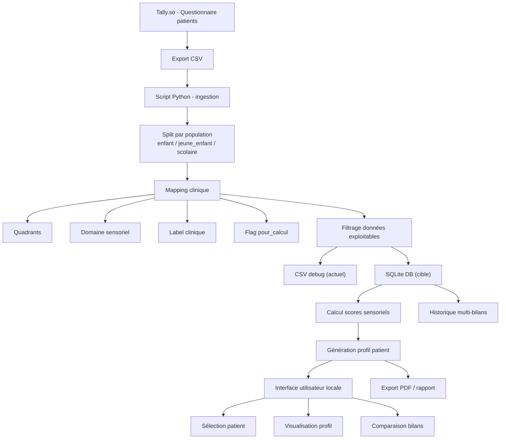

# Profil Sensoriel App - Spécifications Techniques

## Contexte

Outil destiné aux psychomotriciennes pour remplacer Excel. Permet de visualiser rapidement le profil sensoriel des patients en fonction de leurs réponses à un questionnaire en ligne.

---

## 1. Entrées

- CSV exporté depuis Tally.so
- Champs clés :
  - patient_id
  - question_id
  - réponse
  - population (`enfant`, `jeune_enfant`, `scolaire`)

---

## 2. Pipeline transformation (Moteur clinique)

1. **Split par population**
2. **Mapping**
   - Quadrants
   - Domaine sensoriel
   - Label pour calcul
   - Composante scolaire (si applicable)
3. **Filtrage**
   - Sélection des réponses calculables (`pour_calcul=oui`)
4. **Export debug**
   - CSV pour vérification
5. **Persistance**
   - SQLite pour stockage structuré (patients + réponses + scores)

---

## 3. Calculs (en cours)

- Score par quadrant
- Score global (optionnel)
- A intégrer dans le futur pipeline

---

## 4. UI / Présentation (à définir)

- Simple, “one click open”
- Navigation rapide par patient et type de bilan
- Visualisation graphique multi-dimensionnelle
- Lecture intuitive pour psychomotriciennes

---

## 5. Backlog produit

### Priorité haute

- Centraliser le pipeline dans une seule logique multi-population
- Normaliser les champs NaN entre populations
- Mise en place de SQLite pour éviter CSV debug

### Priorité moyenne

- Calcul et affichage des scores sensoriels
- Interface simple pour consultation des profils
- API FastAPI pour intégration future

### Priorité basse

- Historique multi-bilan
- Export PDF ou reporting
- Gestion multi-utilisateurs

## Pipeline système (actuel + cible)

