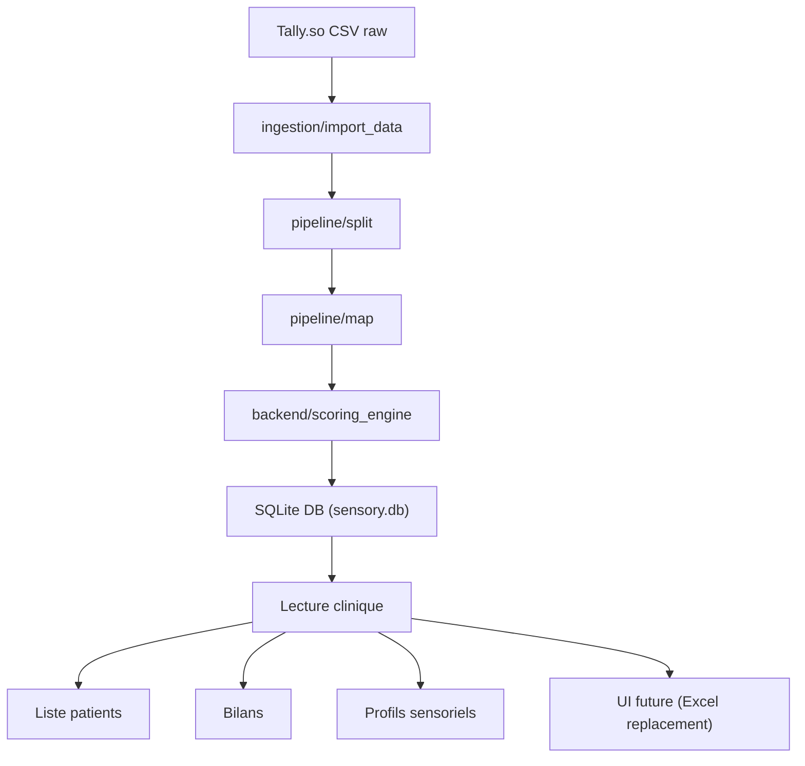

# 🧠 Architecture cible (simplifiée + stabilisée)

---

## 🧭 Architecture finale recommandée



---

## 🧱 Structure cible propre (refactor léger, pas destructif)

```text id="struct1"
app/
├─ backend/
│  ├─ scoring_engine.py
│  ├─ scoring.py
│  ├─ services/
│
├─ ingestion/
├─ pipeline/
├─ storage/
│  ├─ sqlite.py   ← NEW (point central DB)
│
├─ config/
├─ data/
│  ├─ raw/
│  ├─ debug/
│  ├─ reference/
│
├─ database/
│  ├─ sensory.db  ← unique DB active
│
├─ main.py
```

---

## 🧠 Rôle de SQLite (clarifié)

### 📦 SQLite devient

* stockage patients
* stockage bilans
* stockage scores
* historique clinique


---

## 🧠 Flux logique final

### 1. Ingestion

CSV → Python

### 2. Transformation

split + mapping clinique

### 3. Scoring

backend scoring engine

### 4. Persistance

SQLite (source unique)

### 5. Lecture métier

UI / analyse clinique

---
---

### 👉 il manque 1 bloc critique

#### UI clinique minimale

Fonctions :

* liste patients
* sélection patient
* affichage bilans
* comparaison simple

## cible ?

```text
profil-sensoriel-app/
├─ app/
│  ├─ core/
│  │  ├─ scoring/
│  │  ├─ mapping/
│  │
│  ├─ etl/
│  │  ├─ ingest.py
│  │  ├─ split.py
│  │  ├─ map.py
│  │
│  ├─ storage/
│  │  ├─ sqlite.py   ← UNIQUE DB layer
│  │
│  ├─ config/
│  ├─ api/ (future FastAPI)
│
├─ data/
│  ├─ raw/
│  ├─ reference/
│  ├─ debug/ (option dev only)
│
├─ database/
│  ├─ sensory.db     ← UNIQUE DB
│
├─ main.py           ← UNIQUE entrypoint
├─ requirements.txt
├─ README.md
├─ SPEC.md
```
