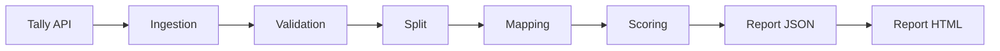

Voici un README.md complet pour votre projet **Profil Sensoriel** :
# 🧠 Profil Sensoriel - Application d'Analyse et de Scoring


Application Python pour l'ingestion, le traitement et l'analyse des données du questionnaire du Profil Sensoriel. Le système récupère automatiquement les réponses depuis l'API Tally, effectue un scoring standardisé et génère des rapports personnalisés au format JSON et HTML.

## 📋 Table des matières

- [Fonctionnalités](#-fonctionnalités)
- [Prérequis](#-prérequis)
- [Installation](#-installation)
- [Configuration](#-configuration)
- [Structure du projet](#-structure-du-projet)
- [Utilisation](#-utilisation)
- [Pipeline de traitement](#-pipeline-de-traitement)
- [Génération des rapports](#-génération-des-rapports)
- [Dépannage](#-dépannage)
- [Tests](#-tests)
- [Licence](#-licence)

## ✨ Fonctionnalités

- **Ingestion automatique** des données depuis l'API Tally
- **Nettoyage et validation** des soumissions
- **Scoring standardisé** basé sur des normes de référence
- **Génération de rapports** individuels au format JSON et HTML
- **Gestion des âges** et des tranches d'âge (enfants, jeunes enfants, scolaires)
- **Traçabilité** complète des données (hash, versions, archivage)
- **Mode debug** pour faciliter le développement
- **Gestion sécurisée** des tokens API

## 📦 Prérequis

- Python 3.10 ou supérieur
- pip (gestionnaire de paquets Python)
- Accès à l'API Tally (token d'authentification)

## 🔧 Installation

### 1. Cloner le dépôt

```bash
git clone https://github.com/votre-username/profil-sensoriel-app.git
cd profil-sensoriel-app
```

### 2. Créer un environnement virtuel (recommandé)

```bash
# Windows
python -m venv venv
venv\Scripts\activate
```

```bash
# macOS / Linux
python -m venv venv
source venv/bin/activate
```

### 3. Installer les dépendances

```bash
pip install -r requirements.txt
```

### 4. Configuration du token Tally

L'application vous demandera automatiquement votre token Tally lors du premier lancement. Vous pouvez également le configurer manuellement :

```bash
# Créer un fichier .env à la racine du projet
echo "TALLY_TOKEN=votre_token_ici" > config/.env
```

## ⚙️ Configuration

### Fichier `config/runtime.json`

```json
{
  "debug": true,          // Mode debug (affichage détaillé)
  "generate_html": true,  // Génération automatique des rapports HTML
  "forms": {
    "enfant": "QKzLAp",        // ID du formulaire Tally
    "jeune_enfant": "kdk7YJ",
    "scolaire": "Me7JAg"
  }
}
```

### Données de référence

Placez vos fichiers de référence dans `data/reference/` :

- `reference.json` : Mapping des questions (domaines, quadrants, etc.)
- `normes.json` : Normes statistiques par tranche d'âge
- `ages.json` : Définition des tranches d'âge

## 📁 Structure du projet

```
profil-sensoriel-app/
├── config/                    # Configuration
│   ├── runtime.json          # Configuration runtime
│   ├── settings.py           # Gestion de la configuration
│   └── .env                  # Variables d'environnement (token)
├── core/                      # Logique métier
│   ├── age.py                # Calcul de l'âge et des tranches
│   ├── norms.py              # Résolution des normes
│   └── scoring_math.py       # Calculs statistiques (z-score, percentiles)
├── data/                      # Données
│   ├── raw/                  # Données brutes (archives)
│   ├── reference/            # Fichiers de référence
│   └── report/               # Rapports générés
├── ingestion/                 # Ingestion des données
│   └── fetch_tally.py        # Récupération depuis l'API Tally
├── pipeline/                  # Pipeline de traitement
│   ├── validate.py           # Validation des données
│   ├── split.py              # Extraction et structuration
│   ├── mapping.py            # Enrichissement avec les références
│   └── scoring.py            # Calcul des scores
├── reporting/                 # Génération des rapports
│   ├── report.py             # Export JSON
│   ├── generate_html.py      # Génération HTML
│   └── template_resultat.html # Template HTML
├── storage/                   # Gestion du stockage
│   ├── io_utils.py           # Utilitaires d'écriture/lecture
│   ├── state.py              # Gestion de l'état (hash)
│   └── data_fingerprint.py   # Calcul d'empreintes
├── utils/                     # Utilitaires divers
│   ├── age.py                # Utilitaires d'âge
│   └── logger.py             # Logging
├── scripts/                   # Scripts utilitaires
│   └── regenerate_html.py    # Régénération des rapports HTML
├── tests/                     # Tests
│   └── test.py               # Tests unitaires et d'intégration
├── main.py                    # Point d'entrée principal
└── requirements.txt          # Dépendances Python
```

## 🚀 Utilisation

### Lancement du pipeline complet

```bash
python main.py
```

Le pipeline va :
1. Récupérer les soumissions depuis l'API Tally
2. Valider et structurer les données
3. Appliquer le scoring
4. Générer les rapports JSON et HTML

### Génération HTML en lot

Pour régénérer tous les rapports HTML à partir des JSON existants :

```bash
python scripts/regenerate_html.py
```

### Génération HTML individuelle

```bash
python -m reporting.generate_html data/report/rapport.json data/reference/reference.json data/report/rapport.html
```

## 🔄 Pipeline de traitement

Le pipeline suit les étapes suivantes :



### 1. Ingestion (`fetch_tally`)
- Récupération des données via l'API Tally
- Gestion des erreurs (401, timeout, etc.)

### 2. Validation (`validate.py`)
- Vérification de la structure des données
- Filtrage des soumissions vides

### 3. Split (`split.py`)
- Extraction des données patient
- Extraction des réponses sensorielles
- Extraction des commentaires
- Calcul de l'âge

### 4. Mapping (`mapping.py`)
- Enrichissement des réponses avec les références
- Association aux domaines et quadrants
- Marquage des questions à inclure dans le scoring

### 5. Scoring (`scoring.py`)
- Calcul des scores bruts par domaine/quadrant
- Calcul du z-score
- Application des normes par tranche d'âge

### 6. Report (`report.py` + `generate_html.py`)
- Construction du rapport final
- Export JSON
- Génération HTML (optionnelle)

## 📊 Génération des rapports

### Structure du rapport JSON

```json
{
  "submission_id": "12345",
  "patient": {
    "nom": "Dupont",
    "prenom": "Jean",
    "age": 8.5,
    "age_group": "6-8",
    "form_type": "scolaire"
  },
  "domains": {
    "auditif": {
      "raw": 42,
      "mean": 35.0,
      "sigma": 8.5,
      "z": 0.82
    }
  },
  "quadrants": {
    "recherche": {
      "raw": 62,
      "mean": 55.0,
      "sigma": 10.2,
      "z": 0.69
    }
  },
  "responses": {
    "1": 3,
    "2": 4,
    ...
  },
  "comments": {
    "Auditif": "L'enfant présente des difficultés...",
    ...
  }
}
```

### Rapport HTML

Le rapport HTML est généré à partir du template `reporting/template_resultat.html`. Il présente les résultats sous forme de graphiques et de tableaux interactifs.

## 🔍 Dépannage

### Erreur 401 - Token invalide

L'application vous demandera automatiquement un nouveau token. Vous pouvez également le mettre à jour manuellement :

```bash
echo "TALLY_TOKEN=nouveau_token" > config/.env
```

### Les données ne sont pas mises à jour

L'application utilise un système de hash pour éviter de retraiter les données inchangées. Pour forcer une mise à jour :

```bash
# Supprimer l'état
rm data/raw/.state.json

# Ou relancer avec un paramètre (à implémenter)
python main.py --full-refresh
```

### Erreur "missing_age_group"

Vérifiez que les tranches d'âge dans `data/reference/ages.json` correspondent à celles dans `data/reference/normes.json`.

### Le HTML ne s'affiche pas correctement

- Vérifiez que le template `reporting/template_resultat.html` existe
- Assurez-vous que les données JSON sont valides
- Ouvrez la console développeur du navigateur pour voir les erreurs JavaScript

## 🧪 Tests

### Exécuter les tests

```bash
python tests/test.py
```

### Vérifier la cohérence référentielle

Le fichier de test inclut des audits pour vérifier la cohérence entre :
- La référence (`reference.json`) et les normes (`normes.json`)
- La référence et les données mappées

## 📝 Développement

### Ajouter ou modifier un formulaire

1. Ajouter l'ID du formulaire dans `config/runtime.json`
2. Créer la référence dans `data/reference/reference.json`
3. Ajouter les normes dans `data/reference/normes.json`
4. Définir les tranches d'âge dans `data/reference/ages.json`

### Mode Debug

Activez le mode debug dans `config/runtime.json` :

```json
{
  "debug": true
}
```

Vous verrez alors des logs détaillés du traitement.

## 📄 Licence

Ce projet est propriétaire et confidentiel. Toute reproduction ou distribution est interdite sans autorisation explicite.

---

## 📞 Support

Pour toute question ou problème, contactez l'équipe de développement.

---
```md
**Version**: 1.0.0  
**Dernière mise à jour**: Juin 2026
```

## 🎨 Badges (optionnels)

Vous pouvez ajouter ces badges en haut du README :

```markdown

```

## 📋 Checklist de configuration

Pour une installation rapide, voici la checklist :

- [ ] Python 3.10+ installé
- [ ] Dépôt cloné
- [ ] Environnement virtuel créé
- [ ] Dépendances installées
- [ ] Token Tally configuré
- [ ] Fichiers de référence placés dans `data/reference/`
- [ ] `runtime.json` configuré avec les IDs des formulaires
- [ ] Test effectué avec `python main.py`
